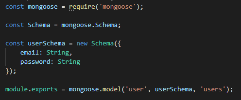
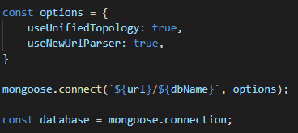
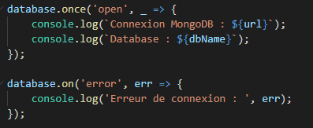

# Web Service Authentification 

Vous pouvez accéder au [code source](https://github.com/RexT2507/Projet_Web_Service_Enigma) du projet.

* Pour la partie authentification du projet j'ai décidé mettre en place une API Rest sous Express en JavaScript avec le FrameWork Node.JS

# 

## Les modules utilisés dans le projet

# 

On va lister ces modules :

* `express`      - Le module Express fournit de petits outils robustes pour les serveurs HTTP, ce qui en fait une excellente solution pour les applications à page unique, les sites Web, les hybrides ou les API HTTP publiques.

* `mongoose`     - Le module Mongoose fournit une solution simple basée sur un schéma pour modéliser les données de votre application. Il comprend la conversion de type intégrée, la validation, la création de requêtes, les crochets de logique métier et plus encore, prêts à l'emploi.

* `bcrypt`       - Le module bcrypt facilite le hachage et la comparaison des mots de passe dans Node. Si vous venez d'un arrière-plan PHP, ceux-ci sont à peu près équivalents à password_hash () et password_verify ().

* `jsonwebtoken` - Le module JSON Web Token (JWT) est une norme ouverte (RFC 7519) qui définit une manière compacte et autonome de transmettre en toute sécurité des informations entre les parties en tant qu'objet JSON.

# 

## Connexion à la MongoDB

# 

Dans un premier temps je crée mon model User :

Ensuite j'importe le fichier dans mon fichier contenant les routes de mon API.

Je définis l'url et le nom de la base de données MongoDB.

Je paramètre les options et j'effectue la connexion.

Une fois la connexion effectué, j'ouvre la base de données, et s'il y a une erreur je l'affiche.

# 

## Fonction de vérification du Token

# 

Afin de vérifier le Token lors du login, j'ai mis en place une fonction de vérification.

# 

## Méthode de création d'un nouvel utilisateur

# 

Dans un premier temps nous encryptons le mot de passe, puis on récupère l'email de l'utilisateur, enfin on attribue un id et on crée le nouvel utilisateur dans lequel on signe l'id avec un token.

# 

## Méthode de connexion d'un utilisateur

# 

On compare l'email afin de savoir si l'utilisateur fait parti de la base de données, on compare le mot de passe enfin si les deux étapes ont été effectués avec succès on attribue un token avec une date d'expiration et les informations de l'utilisateur.

# 

## Méthode d'accès au profile utilisateur

# 

Il est possible d'accéder aux informations de l'utilisateur, cependant la route n'est accessible uniquement aux personnes qui ont un token valide.

