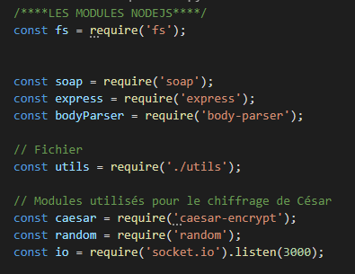
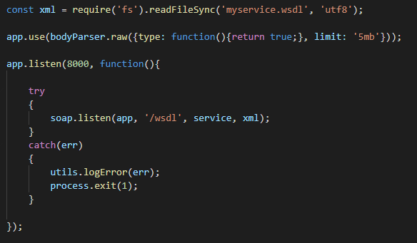
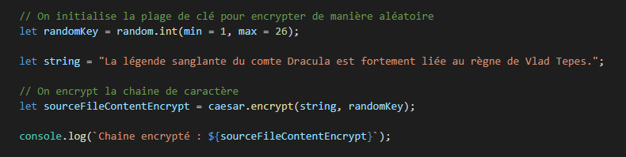
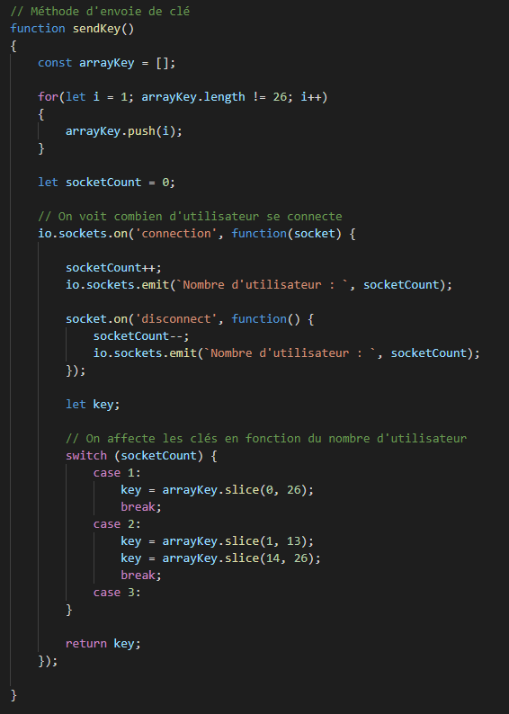
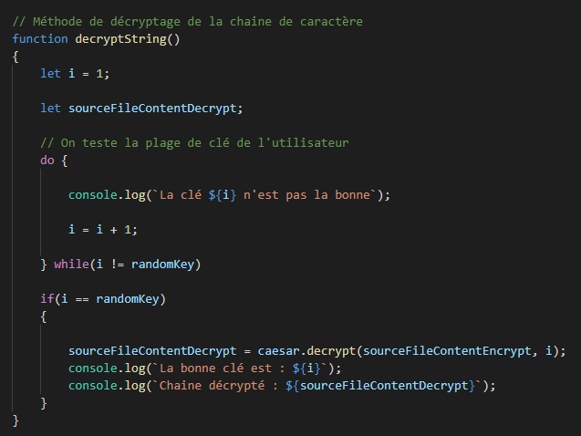

# Web Socket Caesar

Vous pouvez accéder au [code source](https://github.com/RexT2507/Projet_Web_Service_Enigma) du projet.

* Pour la partie envoie de message chiffré ainsi que des clés pour les décoder, j'ai mit en place un Web Socket SOAP.

# 

## Les modules utilisés dans le projet

# 

On va lister ces modules :

* `express`      - Le module Express fournit de petits outils robustes pour les serveurs HTTP, ce qui en fait une excellente solution pour les applications à page unique, les sites Web, les hybrides ou les API HTTP publiques.

* `soap`         - Ce module vous permet de vous connecter aux services Web à l'aide de SOAP. Il fournit également un serveur qui vous permet d'exécuter vos propres services SOAP.z

* `body-parser`   - Analysez les corps des requêtes entrantes dans un middleware avant vos gestionnaires, disponibles sous la propriété req.body.

* `caesar-encrypt`- Le chiffrement César, également connu sous le nom de chiffrement par décalage, est l'une des formes de chiffrement les plus simples. Il s'agit d'un chiffre de substitution où chaque lettre du message d'origine (appelée le texte en clair) est remplacée par une lettre correspondant à un certain nombre de lettres vers le haut ou vers le bas dans l'alphabet

* `random`        - Bienvenue dans le module le plus aléatoire sur npm

* `socket.io`     - Socket.IO permet une communication bidirectionnelle en temps réel basée sur les événements.

# 

## Création du serveur SOAP

# 

Dans un premier temps on crée le serveur SOAP.

# 

## Mise en place des services du SOAP

# 

On crée des services afin de mettre en place les fonctions du SOAP

# 

## Encodage de Cesar

# 

On initialise

# 

## Méthode d'envoi de clé

# 

# 

## Méthode de décryptage des chaines de caractère

# 

